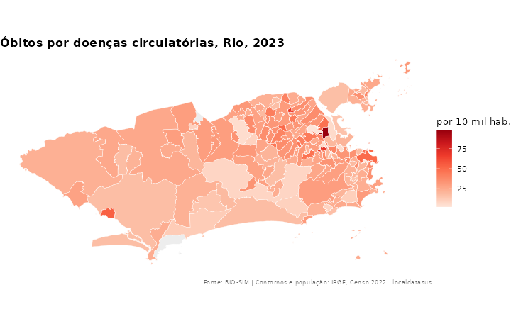
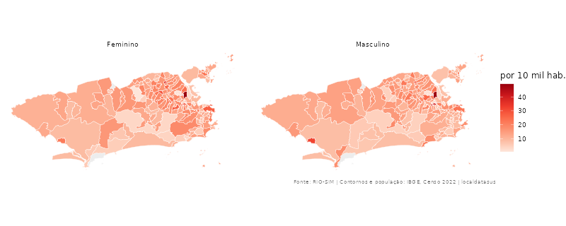
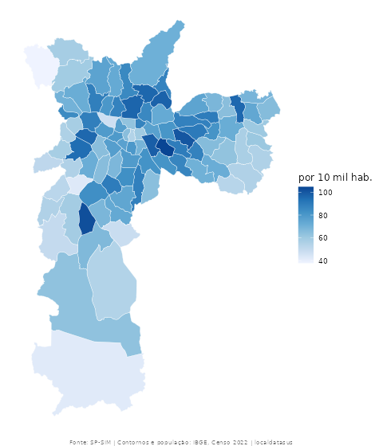
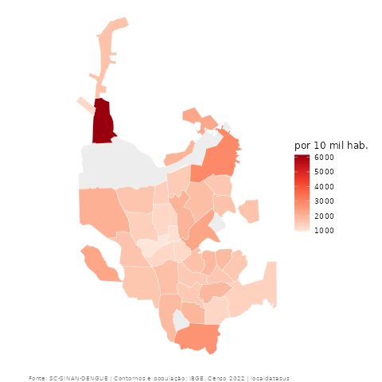

Os mapas precisam de três pacotes, instalados uma vez:

```r
install.packages(c("sf", "ggplot2", "leaflet"))
```

## Mapa estático

```r
library(localdatasus)

circ <- obitos_bairro("Rio de Janeiro", 2023, cid = "I")
mapa_bairro(circ, titulo = "Óbitos por doenças circulatórias, Rio de Janeiro, 2023")
```



- **Cor:** por padrão, o mapa é pintado pela **taxa por 10 mil habitantes**.
- **Contornos:** são os oficiais do IBGE (Censo 2022), baixados uma vez por estado.
- **Cinza:** bairros sem dado.

### Escolher o que pintar e as cores

```r
mapa_bairro(circ, valor = "obitos")             # pinta pela contagem
mapa_bairro(circ, cores = "Blues")              # outras paletas: "YlOrRd", "Greens", "Purples"...
```

### Painéis automáticos

Se a tabela tiver um `por` (ou vários anos), o mapa é dividido em painéis:

```r
por_sexo <- obitos_bairro("Rio de Janeiro", 2023, cid = "I", por = "sexo")
mapa_bairro(subset(por_sexo, sexo != "Ignorado"))
```



### Outros lugares

::: {layout-ncol=2}



:::

```r
mapa_bairro(obitos_bairro("São Paulo", 2023), cores = "Blues")
mapa_bairro(agravos_bairro("dengue", "Joinville", 2024))
```

### Ajustar e salvar

`mapa_bairro()` devolve um gráfico **ggplot2** comum:

```r
library(ggplot2)
mapa <- mapa_bairro(circ) + labs(subtitle = "Fonte: SMS-Rio")
ggsave("mapa.png", mapa, width = 8, height = 5, dpi = 300)
```

## Mapa interativo

```r
mapa_interativo(agravos_bairro("dengue", "Rio de Janeiro", 2024))
```

O mapa abre no *Viewer* do RStudio, com um mapa de ruas ao fundo. Passe o mouse sobre um bairro para ver o nome, ou clique para ver casos, taxa e população. Para salvar como página web:

```r
m <- mapa_interativo(circ)
htmlwidgets::saveWidget(m, "mapa.html")
```

## No QGIS

Toda tabela tem `lat` e `lon`. No QGIS, use *Camada → Adicionar camada → Texto delimitado*, com X = `lon` e Y = `lat`. Para os polígonos, use `codigo_ibge` para juntar com a malha de bairros do IBGE.

## Bairros com poucos moradores: taxa suavizada

Em bairros com pouca população, poucos casos já produzem taxas muito altas. No Recife, por exemplo, Santo Antônio tem 447 moradores: 24 casos de dengue em 2024 dão 537 por 10 mil, mais que o triplo dos bairros populosos. Essas taxas variam muito por acaso de um ano para outro e dominam a escala do mapa.

A saída é a **taxa suavizada** (bayesiano empírico): cada taxa é puxada em direção à média do município, com força maior nos bairros pouco populosos e quase nenhuma nos populosos.

```r
dengue <- agravos_bairro("dengue", "Recife", 2024)
mapa_bairro(dengue, suavizar = TRUE)

# A coluna com a taxa suavizada, para tabelas e análises
suavizar_taxas(dengue)
```

No exemplo, Santo Antônio passa de 537 para 224 por 10 mil, enquanto Ibura, com 45 mil moradores, quase não muda (de 144 para 143).

## Local da ocorrência: SAMU

Os chamados do SAMU registram **onde aconteceu** a ocorrência, não onde a pessoa mora. Em áreas centrais, comerciais ou com grandes hospitais, muita gente circula e pouca gente mora, e a taxa por morador fica artificialmente alta. Nesses casos, mapeie a contagem:

```r
samu <- samu_bairro("Recife", 2024, tipo = "causas externas")
mapa_bairro(samu, valor = "chamados")
```

**Próximo:** [4. Internações e microdados com CEP](internacoes-e-cep.html)
